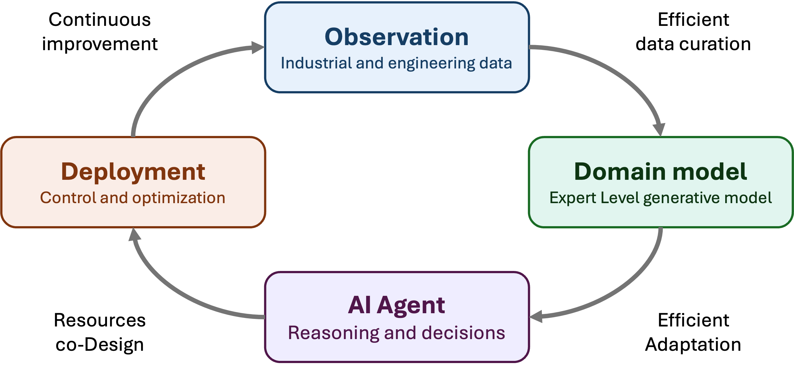
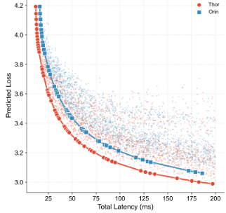
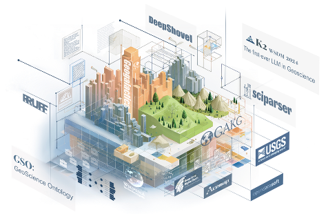
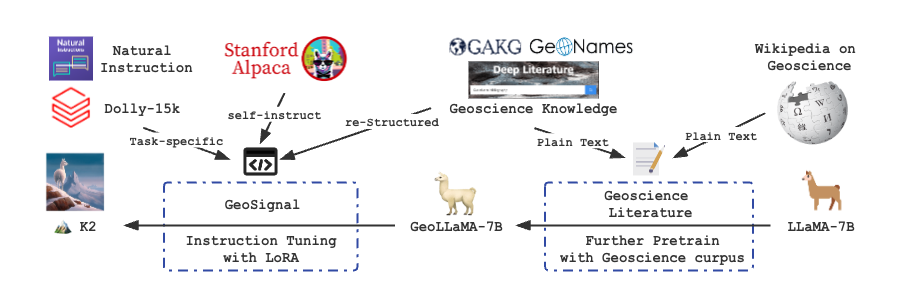
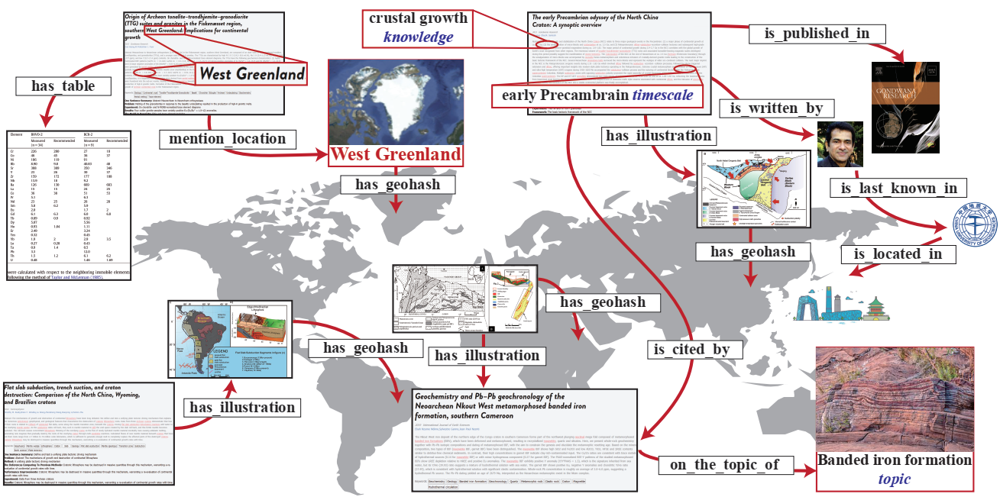

## About Me

I build efficient AI systems that make foundation models and agents practical for real-world products, edge devices, and intelligent infrastructure.

Currently, I am a Research Fellow at the Bayes Centre, University of Edinburgh, working in collaboration with [Prof. Luo Mai](https://luomai.github.io/), [Prof. Jeff Pan](https://knowledge-representation.org/j.z.pan/), and [Prof. Jun Wang](http://www0.cs.ucl.ac.uk/staff/jun.wang/). I also serve as a Visiting Research Fellow at Li Auto. Prior to joining the University of Edinburgh, I was a Research Assistant at the Hong Kong University of Science and Technology (Guangzhou), where I worked with Prof. *Lei Chen* and Prof. *Lionel M. Ni*. I obtained my Ph.D. at Shanghai Jiao Tong University, where I was fortunate to be supervised by Prof. *Weinan Zhang*, Prof. *Luoyi Fu*, and Prof. *Xinbing Wang*. During my early research career, I interned with the Data Team at TikTok and worked as an Applied Scientist Intern at Amazon Shanghai AI Lab. In 2021, I was selected for the *Wenjun Wu Honored Ph.D. Class*.

My research focuses on building <strong>efficient and deployable AI agent systems</strong>, spanning data-centric model training, efficient machine learning algorithms, and AI agents. My goal is to translate cutting-edge AI research into practical solutions for real-world industrial and manufacturing applications. 

## News

- **[2026-04]** 2 papers accepted by ACL Main Conference 2026, 2 papers accepted by ICLR 2026, 1 paper accepted by MLSys 2026!
- **[2026-04]** I hosted an academic workshop at the Bayes Centre, University of Edinburgh, titled "Edge AI Agent Workshop", where I also delivered a talk on "Efficient AI Agent on the Edge".
- **[2026-03]** Invited show on [NiklasOPF Prodcast](https://www.youtube.com/@niklasopf), sharing "PLM: Peripheral Language Model" and "Hardware co-Design Scaling Law"!
- **[2026-02]** Invited talk on "Efficient LLM on the Edge" at the [Cardiff NLP Group seminar](https://cardiffnlp.github.io/event/2026-02-05/) in Cardiff University!
- **[2025-12]** Invited talk on "Efficient Physical AI and Beyond" at Li Auto AI Sharing seminar!

## Highlights

    

      

        
        <video class="hl-media" src="./liauto/effvla.mp4" autoplay muted loop playsinline preload="auto"></video>
      

      <h3>Hardware Co-Design Scaling Law</h3>
      
Roofline-based scaling laws matching LLM/VLA architectures to edge hardware under latency, memory, and energy constraints.

      
<a href="https://arxiv.org/abs/2602.10377" target="_blank">arXiv</a>

    

    

      

        <video class="hl-media" src="./plm/sample-1.mp4" autoplay muted loop playsinline preload="metadata"></video>
        <video class="hl-media" src="./plm/sample-2.mp4" autoplay muted loop playsinline preload="metadata"></video>
      

      <h3>PLM — Peripheral Language Model</h3>
      
A 1.8B model hardware-co-designed for on-device and ubiquitous computing.

      
<a href="https://arxiv.org/abs/2503.12167" target="_blank">arXiv</a><a href="https://github.com/plm-team/PLM" target="_blank">Code</a>

    

    

      

      <h3>World Action Models Fast Adaptation to Tasks</h3>
      
Learning world action models for specific tasks only using limited industrial data.

      
Ongoing

    

    

      
      <h3>GeoGalactica</h3>
      
A scientific large language model for geoscience knowledge and discovery.

      
<a href="https://arxiv.org/abs/2401.00434" target="_blank">arXiv</a><a href="https://github.com/geobrain-ai/geogalactica" target="_blank">Code</a>

    

    

      
      <h3>K2</h3>
      
The first foundation language model for geoscience knowledge understanding and utilization.

      
<a href="https://arxiv.org/abs/2306.05064" target="_blank">arXiv</a><a href="https://github.com/davendw49/k2" target="_blank">Code</a>

    

    

      
      <h3>GAKG</h3>
      
A multimodal geoscience academic knowledge graph.

      
<a href="https://gakg.acemap.info/" target="_blank">Page</a><a href="https://github.com/davendw49/gakg" target="_blank">Code</a>

    





## Funding

- **Bayes Centre Strategy and Innovation Fellowship**, University of Edinburgh, 2025
- **Wenjun Wu AI Honour PhD Scholarship**, Shanghai Jiao Tong University, 2021


