## About Me

I develop **efficient foundation models and agents that move from language to physical intelligence**. My research spans natural language processing, foundation-model training, efficient model architecture and inference, and embodied AI, with a growing focus on VLA models, robotic agents, and hardware–model co-design for real-world deployment.

A central question across my work is how to build capable AI systems under real constraints on compute, memory, latency, energy, and interaction: from language models running on edge devices to embodied agents acting on robots and vehicles.

Currently, I am a Research Fellow at the Bayes Centre, University of Edinburgh, working in collaboration with [Prof. Luo Mai](https://luomai.github.io/), [Prof. Jeff Pan](https://knowledge-representation.org/j.z.pan/), and [Prof. Jun Wang](http://www0.cs.ucl.ac.uk/staff/jun.wang/). I also serve as a Visiting Research Fellow at Li Auto. Prior to joining the University of Edinburgh, I was a Research Assistant at the Hong Kong University of Science and Technology (Guangzhou), where I worked with Prof. *Lei Chen* and Prof. *Lionel M. Ni*. I obtained my Ph.D. at Shanghai Jiao Tong University, where I was fortunate to be supervised by Prof. *Weinan Zhang*, Prof. *Luoyi Fu*, and Prof. *Xinbing Wang*. During my early research career, I interned with the Data Team at TikTok and worked as an Applied Scientist Intern at Amazon Shanghai AI Lab. In 2021, I was selected for the *Wenjun Wu Honored Ph.D. Class*.

## Research

My current research is organised around three connected directions:

<ol style="margin:0 0 8px 1.2em;padding:0;">
<li><strong>Efficient Physical AI &amp; Robotics.</strong> VLA and world-action models, embodied agents, and hybrid learned/classical robot systems, with deployments across robotic manipulation, mobile robots, and intelligent vehicles.</li>
<li><strong>Efficient Foundation Models &amp; Agents.</strong> Hardware-aware model architecture, scaling laws, efficient attention and inference, and long-context agent systems for resource-constrained deployment.</li>
<li><strong>NLP, Foundation Models &amp; AI for Science.</strong> Pre-training, post-training, reasoning, agents, and structured knowledge for language and scientific domains.</li>
</ol>

My long-term goal is to understand how models, agents, robot skills, and hardware should be co-designed so that increasingly capable AI can operate reliably in the physical world.

<svg class="eal-venn" viewBox="0 62 440 306" role="img" aria-label="Multimodal perception (vision and sensing), agentic reasoning and planning (NLP and LLMs), and manipulation and navigation (robotics) overlap in a physical AI foundation model">
  <circle class="c1" cx="158" cy="168" r="96"/>
  <circle class="c2" cx="282" cy="168" r="96"/>
  <circle class="c3" cx="220" cy="262" r="96"/>
  <a href="https://www.cdeng.net/note/multimodal-perception" target="_blank">
    <text class="field" x="136" y="128">Vision &amp; Sensing</text>
    <text class="lab" x="136" y="148">Multimodal</text>
    <text class="lab" x="136" y="165">Perception</text>
  </a>
  <a href="https://www.cdeng.net/note/agentic-reasoning-planning" target="_blank">
    <text class="field" x="304" y="128">NLP &amp; LLMs</text>
    <text class="lab" x="304" y="148">Agentic Reasoning</text>
    <text class="lab" x="304" y="165">&amp; Planning</text>
  </a>
  <a href="https://www.cdeng.net/note/manipulation-navigation" target="_blank">
    <text class="field" x="220" y="284">Robotics</text>
    <text class="lab" x="220" y="304">Manipulation</text>
    <text class="lab" x="220" y="321">&amp; Navigation</text>
  </a>
  <a href="https://www.cdeng.net/note/physical-ai-foundation-model" target="_blank">
    <text class="core" x="220" y="200">Physical AI</text>
    <text class="core" x="220" y="215">Foundation Model</text>
  </a>
</svg>

## Selected Research Highlights

🤖 Efficient Physical AI &amp; Robotics

    

      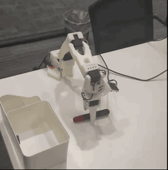
      <h3>Efficient VLA CoRL 2026</h3>
      
A controlled, latency-aware study of modular VLA design. We identify where additional model capacity actually pays off, derive an efficient VLA recipe, and validate transfer from simulation to real robotic manipulation.

      
<a href="https://arxiv.org/abs/2609.13984" target="_blank">arXiv</a>

    

    

      

        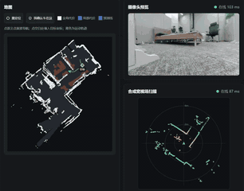
        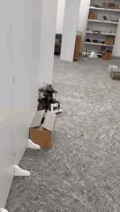
      

      <h3>PhysicalAgent Banbu-supported</h3>
      
An embodied-agent testbed integrating VLA policies, SLAM/navigation, multimodal perception, and task-level agents on an untethered Jetson-powered mobile robot. We use it to study learned/classical skill composition, agent–executor feedback, and resource-aware autonomy in real environments.

      
Ongoing

    

    

      

      <svg class="hl-media" viewBox="0 0 96 120" role="img" aria-label="Agent, VLA policy, and vehicle or robot platform in a feedback loop">
        <defs><marker id="arr" viewBox="0 0 10 10" refX="9" refY="5" markerWidth="4" markerHeight="4" orient="auto-start-reverse"><path d="M0,0 L10,5 L0,10 z" fill="rgba(128,128,128,.7)"/></marker></defs>
        <g fill="rgba(128,128,128,.10)" stroke="rgba(128,128,128,.45)" stroke-width="1.2">
          <rect x="6" y="4" width="84" height="28" rx="7"/><rect x="6" y="46" width="84" height="28" rx="7"/><rect x="6" y="88" width="84" height="28" rx="7"/>
        </g>
        <g stroke="rgba(128,128,128,.7)" stroke-width="1.5" marker-start="url(#arr)" marker-end="url(#arr)"><line x1="48" y1="33.5" x2="48" y2="44.5"/><line x1="48" y1="75.5" x2="48" y2="86.5"/></g>
        <g fill="currentColor" font-size="9.5" font-weight="600" text-anchor="middle">
          <text x="48" y="22">Task-level Agent</text>
          <text x="48" y="64">VLA Policy</text>
          <text x="48" y="101">Vehicle / Robot</text><text x="48" y="111">Platform</text>
        </g>
      </svg>
      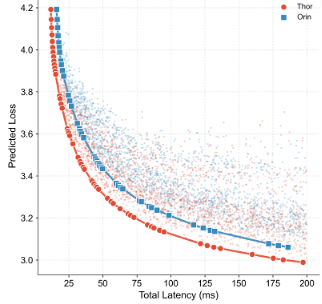
      

      <h3>Efficient Embodied AI for Intelligent Vehicles and Robots Industry</h3>
      
VLA policies, agent–executor systems, and hardware-aware deployment for real-world vehicle and robot platforms through industry collaboration with Li Auto.

      
<a href="https://arxiv.org/abs/2602.10377" target="_blank">Scaling Laws</a><a href="https://arxiv.org/abs/2609.13984" target="_blank">Efficient VLA</a>AdaptiveWAMLong-horizon VLAcoming soon

    

⚡ Efficient Foundation Models &amp; Agents

    

      

        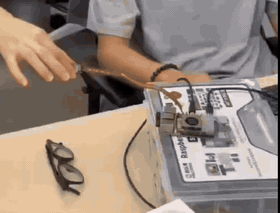
        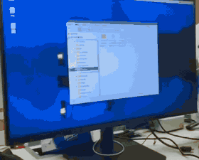
      

      <h3>PLM &amp; Hardware Co-Design Scaling Laws</h3>
      
A 1.8B peripheral language model co-designed with edge hardware, roofline-based scaling laws that choose architectures under latency, memory, and energy budgets, and RooflineBench for benchmarking on-device LLMs.

      
<a href="https://arxiv.org/abs/2503.12167" target="_blank">PLM</a><a href="https://github.com/plm-team/PLM" target="_blank">Code</a><a href="https://arxiv.org/abs/2602.10377" target="_blank">Scaling Laws</a><a href="https://arxiv.org/abs/2602.11506" target="_blank">RooflineBench</a>🤗 13k+ downloadsDAI 2026

    

    

      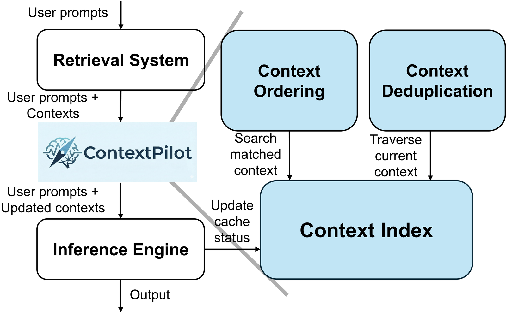
      <h3>ContextPilot MLSys 2026 &amp; MemoryCraft Under review</h3>
      
Long-context agents, from inference to memory: ContextPilot cuts prefill cost through context reuse, ordering, and deduplication; MemoryCraft is a controlled platform for evaluating agent memory systems jointly with their retrieval regimes, backbones, and token cost.

      
<a href="https://arxiv.org/abs/2511.03475" target="_blank">ContextPilot</a><a href="https://github.com/MemoryCraft-Team/OpenMemorycraft" target="_blank">MemoryCraft</a>

    

    

      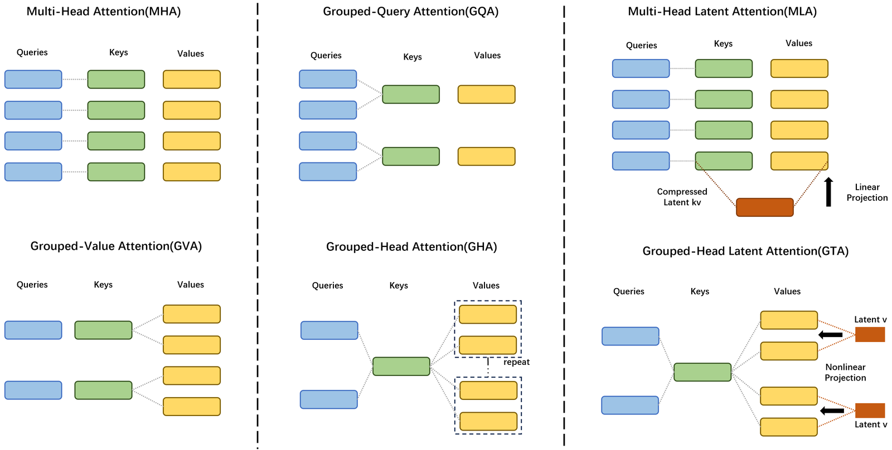
      <h3>GTA: Efficient Attention Preprint</h3>
      
Grouped-head latent attention: sharing attention maps across head groups and decoding values from a compact latent to cut attention FLOPs and KV-cache size at matched quality.

      
<a href="https://arxiv.org/abs/2506.17286" target="_blank">arXiv</a>

    

💬 NLP, Agents &amp; AI for Science

    

      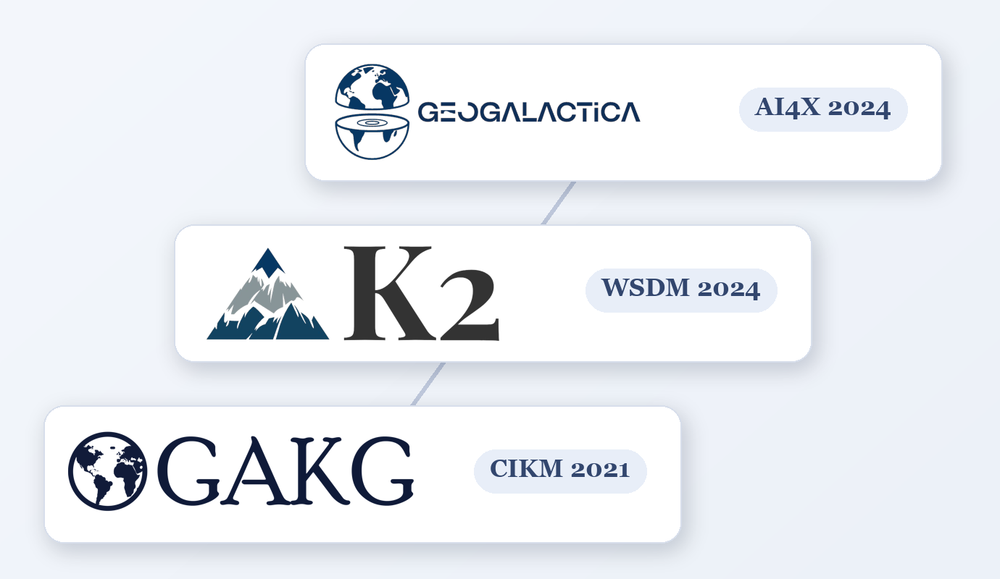
      <h3>GeoGalactica / K2 / GAKG WSDM · AI4X · CIKM</h3>
      
First-generation LLM foundation models for science, covering data acquisition, pre-training, SFT, and RL.

      
<a href="https://arxiv.org/abs/2401.00434" target="_blank">GeoGalactica</a><a href="https://arxiv.org/abs/2306.05064" target="_blank">K2</a><a href="https://gakg.acemap.info/" target="_blank">GAKG</a><i class="fab fa-github"></i> 314 stars🤗 2.9k downloads

    

    

      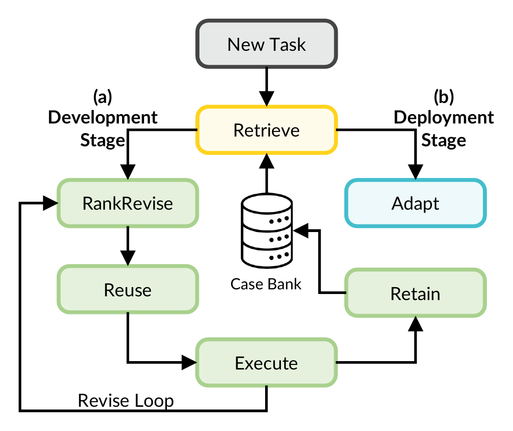
      <h3>DS-Agent ICML 2024</h3>
      
Automated data science with LLM agents: case-based reasoning as agent skills and memory in the era of 2024.

      
<a href="https://arxiv.org/abs/2402.17453" target="_blank">arXiv</a><a href="https://github.com/guosyjlu/DS-Agent" target="_blank">Code</a>

    

    

      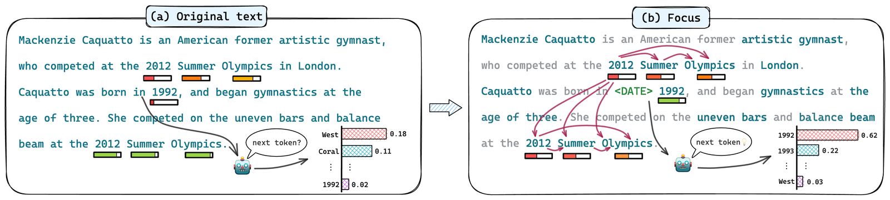
      <h3>Hallucination Detection EMNLP 2023</h3>
      
Uncertainty-based hallucination detection for LLMs with keyword focus and history-aware propagation, improving detection without extra supervision.

      
<a href="https://arxiv.org/abs/2311.13230" target="_blank">arXiv</a>

    

<strong>Platforms.</strong> <em>PhysicalAgent mobile base</em>: a self-built wheeled home robot I lead the team on, NVIDIA Jetson Orin on board, lidar, camera, and microphones, ROS&nbsp;2 navigation, pretrained VLA plus agent loop, running untethered in a real home. Also deployed on Raspberry Pi and consumer phones (PLM), and in-vehicle edge hardware (Li Auto).

## News

- **[2026-09]** [*RooflineBench*](https://arxiv.org/abs/2602.11506) is accepted by DAI 2026!
- **[2026-09]** [*EffVLA*](https://arxiv.org/abs/2609.13984) is accepted by CoRL 2026!
- **[2026-08]** Invited talk on "Large Discovery Model and Geoscience" at the 3rd International Symposium on Deep Underground Science and Engineering in Glasgow!
- **[2026-04]** 2 papers accepted by ACL Main Conference 2026, 2 papers accepted by ICLR 2026 (incl. [*SpatialViz-Bench*](https://arxiv.org/abs/2507.07610)), and [*ContextPilot*](https://arxiv.org/abs/2511.03475) accepted by MLSys 2026!
- **[2026-04]** I hosted an academic workshop at the Bayes Centre, University of Edinburgh, titled "Edge AI Agent Workshop", where I also delivered a talk on "Efficient AI Agent on the Edge".





## Funding

- **Bayes Centre Strategy and Innovation Fellowship**, University of Edinburgh, 2025
- **Wenjun Wu AI Honour PhD Scholarship**, Shanghai Jiao Tong University, 2021


